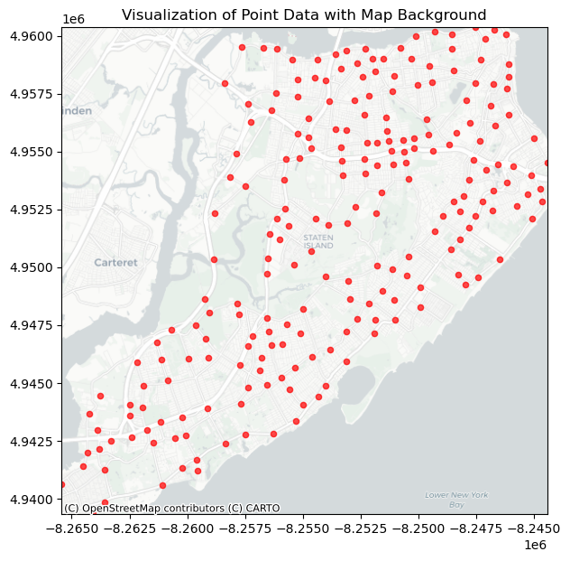
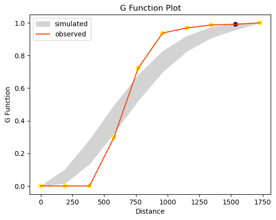
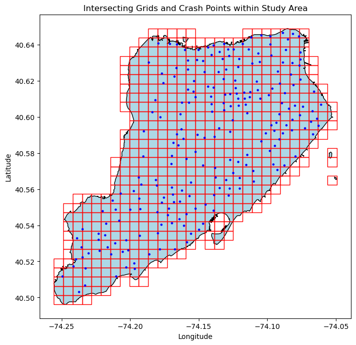
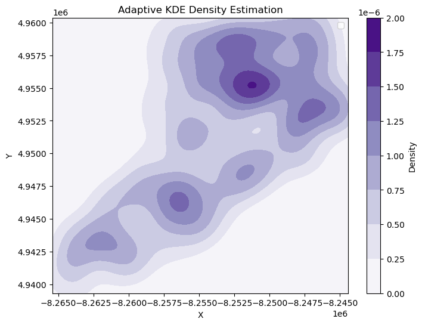
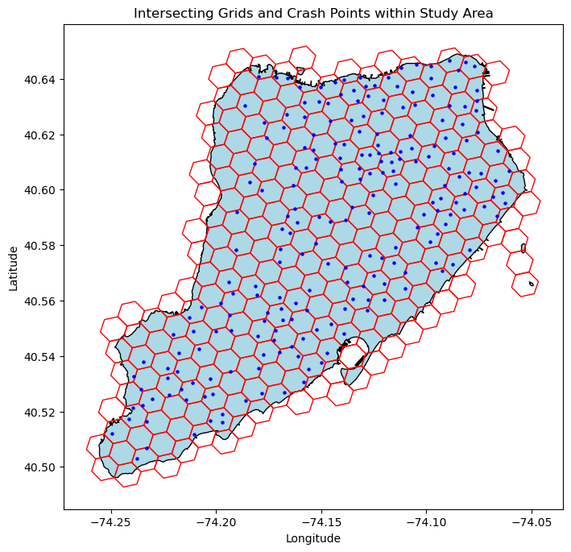
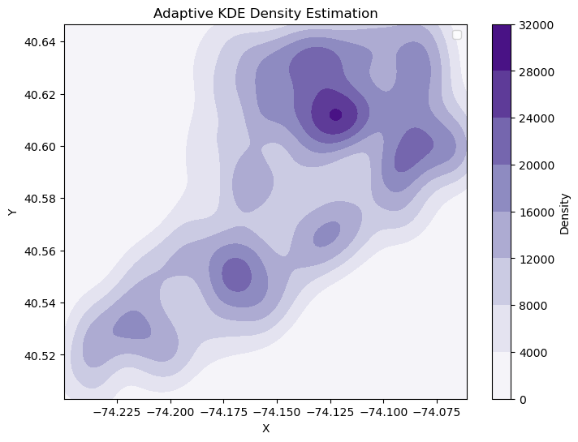

# GeoHD


[**Getting Started**](#getting-started)
| [**Issues**](#issues)
| [**Contribute**](#contribute)
| [**Citation**](#citation)
| [**Authors**](#authors)

## What is GeoHD? 
GeoHD is a Python toolkit for geospatial hotspot detection, visualization, and analysis using urban data. Density-based hotspot detection is an important theory and method in urban research, which realizes the extraction of local research hotspots by combining density analysis and raster algebra. It has been widely used in different fields such as transportation, culture, climate, ecology and so on:

* Transportation ([Yan, Yuchen, et al. (2024)](https://doi.org/10.1111/tgis.13137))
* Housing Submarkets ([Liu, Xinrui, et al.  (2021)](https://doi.org/10.1155/2022/2948352))
* Culture ([Zhang, Haiping, et al.  (2021)](https://doi.org/10.1111/tgis.12682))
* Ecology ([Qian, Chunhua, et al.  (2021)](https://doi.org/10.1177/15501477211039137))

The main functions of GeoHD are fast visualization and hotspot detection based on geospatial point data, and it realizes fixed-bandwidth hotspot detection with adjustable parameters and adaptive-bandwidth hotspot detection. In addition, GeoHD provides spatial point pattern distribution analysis such as Ripley G-function calculation and fast comparison image drawing.

## Getting Started

### Install with pip

The package is available in PyPi and requires [Python 3.11](https://www.python.org/downloads/) or higher. It can be installed using:

```bash
$ pip install GeoHD
```

### Usage

Visualization of hotspots on real maps:

```python
visualize_shapefile('data.shp', output_image_path='custom_image.png')
```

<p align="center">
  
</p>


Analytic Plane Point Patterns: Ripley G, Ripley F, Ripley J, Ripley K, Ripley L, etc. through the plotting function.

```python
plot_g_function('data.shp')
```

<p align="center">
  
</p>

The study area was divided into a quadrilateral (hexagonal) grid and fast visualization was achieved based on the density of point data within the divided area.

```python
create_cell_zones(area_file, crash_file)
create_hex_grid_zones(area_file, crash_file)
create_cell_heatmap(area_file, crash_file)
create_hexagonal_heatmap(area_file, crash_file)
```

<p align="center">
  
  
</p>

<p align="center">
  
  
</p>

Realization of kernel density analysis with fixed bandwidth:

```python
density_raster = process_shapefile(input_file_path)
plot_density_raster(density_raster,output_data_path, *gpd.read_file(input_file_path).total_bounds)
```

Kernel density analysis for realizing adaptive bandwidth:

```python
adaptiveKDE(shp_file,output_data_path)
```

<p align="center">
  
</p>


Hotspot Identification:

```python
hotspots = extract_hotspots(density_data_path)
visualize_hotspots(np.load(density_data_path), hotspots)
```

<p align="center">
  
</p>


## Issues

If you encounter any **bugs** or **problems** with GeoHD, please create a post using our package [issue tracker](https://github.com/yan-yuchen/GeoHD/issues). Please provide a clear and concise description of the problem, with images or code-snippets where appropriate. We will do our best to address these problems as fast and efficiently as possible.

## Contribute

The authors of the GeoHD package welcome external contributions to the source code. This process will be easiest if users adhere to the contribution policy:

* Open an issue on the package [issue tracker](https://github.com/yan-yuchen/GeoHD/issues) clearly describing your intentions on code modifications or additions
* Ensure your modifications or additions adhere to the existing standard of the GeoHD package, specifically detailed documentation for new methods (see existing methods for example documentation)
* Test your modifications to ensure that the core functionality of the package has not been altered by running the unit tests 
* Once the issue has been discussed with a package author, you may open a pull request containing your modifications

## Citation


## Authors

* Yuchen Yan